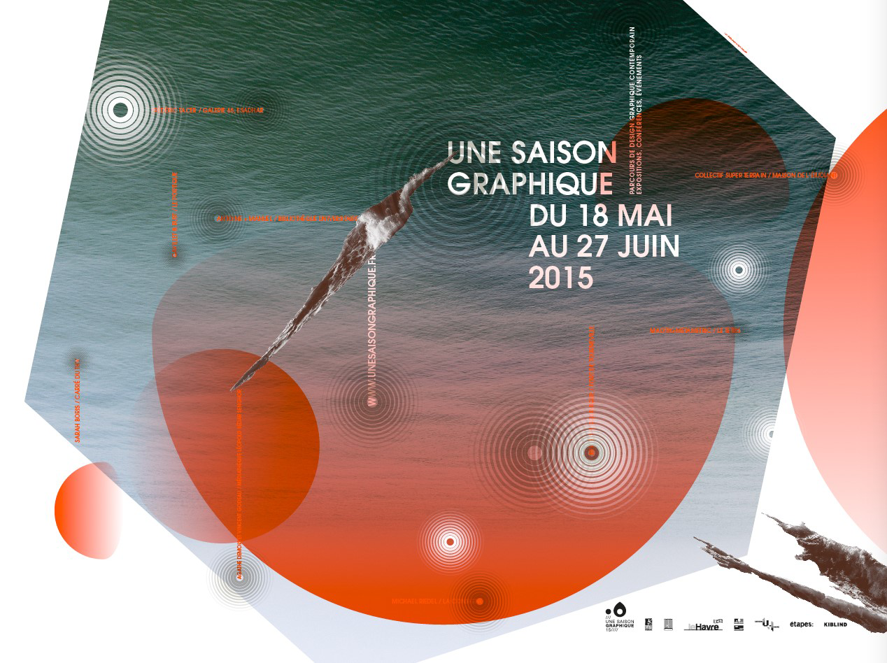

##Une Saison Graphique 15, un état des lieux

La 7e édition de cet événement se déroule du 18 mai au 27 juin 2015, avec en point d'orgue la semaine traditionnelle des vernissages du 18 au 23 mai, qui s'achèvera le samedi 23 mai par un parcours de l'ensemble des expositions, le temps fort de la Kermesse Graphique et de la soirée du Tetris au Fort de Tourneville. Du 15 mai au 18 juin seront également présentées dans l'espace urbain les sept affiches programme conçues par nos invités.

Interroger les formes, questionner les modes de re/présentation du design graphique dans l'espace, produire des images et des projets graphiques qui témoignent du processus tout autant que du résultat, contaminer le regard, offrir des espaces et un temps de parole à une profession contrainte de se réinventer sous la pression du numérique et de la raréfaction de la commande publique et privée, faire naître ou diffuser la culture du design graphique au sein de nos territoires (réel et virtuel), proposer chaque année au public différentes approches, des univers distincts, souvent disjoints, pour que le design graphique soit à nouveau visible et lisible dans l'espace urbain le temps d'une Saison, et plus si affinités. Voici quelques uns de nos objectifs partagés, qui, nous l'espérons, se liront en creux du programme proposé pour cette édition 2015.

*The designer is here*

En proposant de déplacer son studio dans l'exposition qu'elle a imaginée au carré du THV, Sarah Boris fait acte de présence et matérialise cet impératif pour les designers graphiques  d'expliquer leur travail et les problématiques associées à cette pratique professionnelle. Ce n'est pas tant de vulgarisation que le design graphique a besoin aujourd'hui, mais de considération et de compréhension. L'exposition est une adresse au public qui se traduit autant en actes qu'en paroles. Il n'est pas facile aujourd'hui d'organiser en province autant de conférences et de rencontres en appui ou en contrepoint des expositions. Cela nous a toujours semblé un enjeu essentiel pour que le processus de création indissociable de son résultat dans le design graphique puisse être révélé au public. 
Faire acte de présence, et expliquer le rôle assigné au designer graphique dans nos quotidiens peut se faire aussi par la pratique et l'intégration du public au sein même du processus de création : c'est le sens même des projets du collectif Super Terrain et de la seconde édition de la Kermesse Graphique. Pédagogique, généreuse,  entière, cette approche participative a séduit l'an dernier un public large et très divers.

*Graphic design on each side of the border*

L'arrivée du FRAC Haute-Normandie dans les partenaires d'Une Saison Graphique est une étape importante. Elle permet de rappeler et de souligner le fait que le design graphique s'inscrit dans le champ de la création contemporaine, et se nourrit de relations fécondes avec l'art contemporain.  La sélection d'affiches de Michaël Riedel, l'une des dernières acquisitions du FRAC Haute-Normandie, est d'une autre nature. Il est intéressant de montrer ici l'attachement de ce jeune artiste allemand au poster, envisagé comme une série autoproduite d'affiches uniques accompagnant ses expositions, comme un moyen de repenser continuellement son propre flux d'images. 
En l'occurrence, il s'agit moins de franchir une frontière que de favoriser emprunts et apports dans une logique d'interdisciplinarité. Par essence, le graphisme est entre les disciplines, ce que confirment les studios Gavillet & Rust et Antoine+Manuel. La diversité des domaines d'intervention d'Antoine+Manuel (mode, design, architecture intérieure, multimédia) les conduit à considérer l'exposition comme un espace magique, à multiples facettes. Sous tous les angles, le duo questionne et réinterprète sa pratique à la faveur d'installations, offrant au public non pas un regard rétrospectif sur leur travail, mais une expérience sensible d'un univers toujours en construction et en expansion. Particulièrement actif sur la scène de l'art contemporain, le studio Gavillet & Rust conçoit des identités visuelles, affiches et livres en parfaite adéquation avec les réflexions initiées par les artistes. Le studio suisse leur apporte une maîtrise impressionnante de la typographie et des outils de la création graphique, comme un échange de bons procédés. Mais il s'agit avant tout d'un dialogue, un échange d'intellectuels, de penseurs de formes qui se met en place de part et d'autre.  Il est important de restituer les évolutions de ce dialogue. 
Si les frontières sont aussi nécessaires que perméables, elles ne doivent pas faire peur. Savoir questionner tout en pacifiant, c'est un art qu'il faut apprendre très tôt. Les graphistes réussissent parfois à surmonter les murs, les apparences, grâce à, ou sur le territoire de l'illustration jeunesse. Le travail fin et singulier d' Agathe Demois et Vincent Godeau s'attache au-delà des formes à formuler des propositions de lecture créative, à doubler les sens d'interprétation. Leur ouvrage « la grande traversée » témoigne de l'importance grandissante de cette nouvelle scène d'illustrateurs puisant leur motivation aux sources du travail fondateur de Paul Rand ou Bruno Munari. De cette soif d'ouverture à l'autre (son voisin, une autre discipline). « Connaître les images qui nous entourent signifie également les possibilités de contact avec la réalité, voir et comprendre davantage » écrivait Munari. 

*In the past, even the future was better beyond here and across borders.*

L'époque est sombre et la tentation forte de considérer ce présent sans avenir. Le projet initié par Frédéric Tacer est une proposition lucide et malicieuse qui rappelle que le design graphique peut ou doit contribuer à redonner du poids aux objets, là où le numérique semble vouloir nous conduire vers la dématérialisation de nos vies. En concevant la direction artistique d'*Occur Books*,  le jeune graphiste s'assume comme un éditeur fictif de livres imprimés en 2084. L'anticipation est un prétexte pour parler de notre présence au monde qui nous impose de revenir à un artisanat de l'image et de la forme. Demain, le designer graphique sera-t-il encore à même de produire des objets justes et sensibles, s'attachant dans la fabrication à une qualité, une intelligence et un relief qui s'oppose en tout point à la rationalité plate des objets vite manufacturés de l'impression à la demande et de la publication électronique ?
Mathieu Le Sourd AKA Maotik ne dit pas autre chose lorsqu'il puise dans la pensée de Paul Virilio la matière de ses univers numériques immersifs. La vitesse et l'accélération permanente des formes conduisent à des accidents qui fondent son esthétique très SciFi. Il nous rappelle que la production des interfaces doit également nourrir une réflexion critique permanente à même de nous éloigner de la standardisation générale des mondes numériques. 

A cet égard, le site web d'Une Saison Graphique 15, réalisé par une équipe conduite par Bachir Soussi Chiadmi et Sarah Garcin, associant trois étudiants de 4e année en Design graphique de l'ESADHaR, Kévin Tessier, Chengcheng Li et Angélique Boudeau, et ne doit pas être considéré seulement comme un outil de communication mais une marque de notre volonté d'affirmer désormais que le futur du design graphique est également en ligne et qu'il ne faut pas regarder comme une fatalité la faible prise qu'ont aujourd'hui les designers sur la définition des interfaces du web. Au contraire, il demeure un nouveau théâtre des opérations qu'il faudra investir très vite. Nous y reviendrons.
Le programme d'Une Saison Graphique 15 est aussi riche que cet éditorial est long. Mais il nous importait de rappeler que nous ne vous invitons pas simplement à prendre part à un parcours d'expositions qui se résumerait à une série d'accrochage d'oeuvres, comme un gigantesque *Google image* matérialisé dans une ville. Il s'agit bien d'une réflexion critique collective, portée par les propositions des différents designers invités ici, à laquelle nous vous convions à prendre part, une réflexion et des télescopages qui parle de présence, de frontières et du futur.

Le collectif d'Une Saison Graphique
