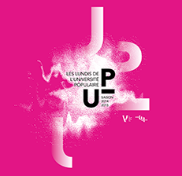

##Informations pratiques :

Conférence de Jean-Pierre Grünfeld   
Le chantier comme récit
en partenariat avec l’Université Populaire (Le Volcan, scène nationale / Université du Havre)

Lundi 11 mai 2015 à 18h30, Le Volcan Niemeyer, petite salle.

###Contact : 

Le Volcan Niemeyer  
Tel: 02 35 19 10 20  
Site: [www.levolcan.com](http://www.levolcan.com)

La Ville peut être considérée comme une « structure narrative » : un système de lieux et de récits où s’entrelacent l’Histoire et les histoires du quotidien de ses habitants. Si nier le passé assassine la Ville, ce passé, lorsqu’il est figé jusqu’à interdire le renouvellement naturel de ses espaces, la stérilise. La juxtaposition des fonctions (les zones) ou la séparation des flux sont des principes anti-urbains.

Seuls les signes pérennes d’appartenance et d’intercessions favorisent l’appropriation des temps et des espaces de la Ville : signalétique, design d’espaces, communication jouent un rôle essentiel dans l’acceptation des projets urbains par les habitants. A cet égard, le chantier et ses signes éphémères constituent les preuves de la vitalité et de la capacité d’une Ville à se renouveler. Mais leur traitement et leur articulation requièrent des décisions politiques et des méthodes visuelles singulières.

Jean-Pierre Grünfeld est sémiologue urbain, consultant. Depuis quarante ans, il conçoit des stratégies d’appropriation des projets urbains pour les collectivités territoriales, en France et à l’étranger (de Prétoria à Los Angeles ou de Toulouse à Bordeaux), en s’appuyant sur des équipes pluridisciplinaires (sociologues, architectes, historiens, cartographes, écrivains, graphistes…).

