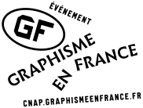

**Une Saison Graphique est une manifestation annuelle consacrée à la création graphique
contemporaine regroupant plusieurs événements au Havre répartis dans différents lieux
culturels de la ville.**

Une saison graphique bénéficie du soutien de : l’Université du Havre, la Ville du Havre, le
Conseil Général de Seine-Maritime, le Conseil Régional de Haute-Normandie et du Ministère de
Culture et de Communication. (logos)

Partenariats : Etapes, Kiblind, Graphisme en France (logos)

**Organisateurs et partenaires**

[contact@unesaisongraphique.fr](mailto:contact@unesaisongraphique.fr)  
[www.unesaisongraphique.fr](http://www.unesaisongraphique.fr)

Conception et réalisation du site web : Bachir Soussi Chiadmi, avec Kévin Tessier, Angélique
Boudeau Chengcheng Li, étudiants de l’ESADHaR

**Tumblr :** [graphismeauhavre.tumblr.com](http://graphismeauhavre.tumblr.com)

**Facebook :**[tinyurl.com/pu7yr3f](http://tinyurl.com/pu7yr3f) 

**Twitter :** [twitter.com/Saisongraphique](http://twitter.com/Saisongraphique)

**Instagram :** [instagram.com/unesaisongraphique](http://instagram.com/unesaisongraphique)

**ORGANISATEURS :**

*Graphisme au Havre* :   
Mariina Bakic, Charlotte Cavé, Virgile Laguin
Courriel : [mariina@unesaisongraphique.fr](mailto:mariina@unesaisongraphique.fr)

*ESADHaR* :   
Thierry Heynen , Vanina Pinter, Yann Owens, Bachir Soussi Chiadmi  
Tél. : 02 35 53 30 31  
Courriel : [esadhar@esadhar.fr](mailto:esadhar@esadhar.fr)  
Site web : [www.esadhar.fr](http://www.esadhar.fr)

*Bibliothèque Universitaire du Havre :*  
Pierre-Yves Cachard, Mathilde Poulain.  
Tél. : 02 32 74 44 33   
Courriel : [bu@univ-lehavre.fr](mailto:bu@univ-lehavre.fr)  
Site web : [bu.univ-lehavre.fr](http://bu.univ-lehavre.fr)

*Service Culturel de l’Université du Havre :*  
Jacqueline Charles-Rault, Josépha Cuvier  
Tél. : 02 32 74 42 43   
Courriel :[service.culturel@univ-lehavre.fr](mailto:service.culturel@univ-lehavre.fr) 

*Réseau Lire au Havre :*  
Dominique Rouet, Frédéric Blanc-Aubert, Nathalie Beaufort Lamy
(programmation et médiation).  
Tél. : 02 32 740 740  
Site web : [lireauhavre.fr](http://lireauhavre.fr)

*Carré du THV - Ville du Havre :*   
Walter Walbrou, Valérie Pottier  
Tél. : 02 35 19 42 47  
Courriel : [saison-thv@lehavre.fr](mailto:saison-thv@lehavre.fr)

*Le Portique :*   
Patrick Lebret, Akané Ward  
Tél. : +33 (0)9 80 85 67 82   
Courriel :[presse@leportique.org](mailto:presse@leportique.org)   
Site web : [www.leportique.org](http://www.leportique.org)

*FRAC Haute Normandie :*   
Véronique Souben, Julie Debeer, Iragaëlle Monnier  
Tél. : 02 35 72 27 51  
Courriel : [frac.haute.normandie@wanadoo.fr](mailto:frac.haute.normandie@wanadoo.fr)  
Site web : [www.frachautenormandie.org/](http://www.frachautenormandie.org/)  

*Le Tetris :*   
Franck Testaert, Johann Schulz  
Tél. : 02 35 19 00 38  
Site web :[www.letetris.fr](http://www.letetris.fr) 

*Papier Machine :*   
Delphine Boeschlin, Benjamin Delaville  
Site web : [papier-machine.fr/
](http://papier-machine.fr/
)

*Lycée St Vincent de Paul :*   
Béatrice Berthelot, Philippe Dony.  
Tél. : 02 35 25 07 18  
Courriel : [st.vincent@online.fr](mailto:st.vincent@online.fr)  
Site web : [www.lycee-saint-vincent-le-havre.com](http://www.lycee-saint-vincent-le-havre.com)

*Librairie La Galerne :*  
Comme chaque année, La Galerne s’associe à la manifestation en
proposant pendant la durée d’Une Saison Graphique une sélection de livres autour du design
graphique et en accueillant certaines rencontres.
La Galerne, 148 rue Victor Hugo - Le Havre   
Site web : [lagalerne.com](http://lagalerne.com)

 
 

